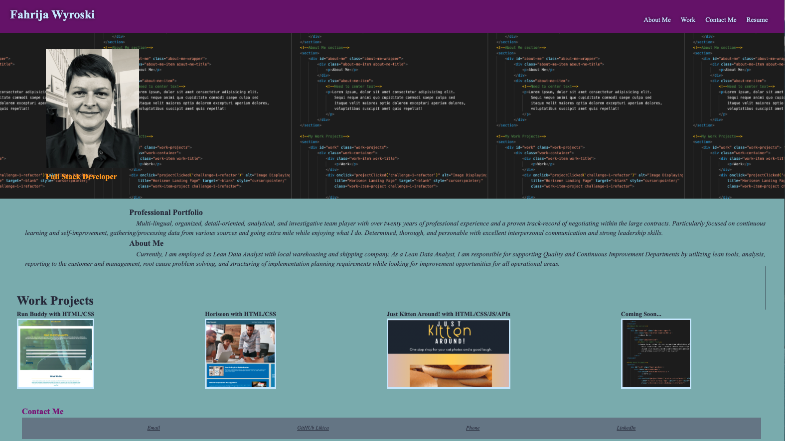

# This is the landing page for F_Wyroski's Professional Portfolio
## Purpose
* This page is to showcase the professional portfolio of F_Wyroski. 
### URL Link to view on web
* 
* Included in this portfolio are: Briefly "About me", "Intro/bio" with technical and soft skills listed, examples of projects linking directly to GitHub Pages launched links, and contact details
   
    

### Built With
* HTML
* CSS

### Page Navigation Tips
* Use top navigation panel to access sections of the webpage such as About Me, Work, Contact Me and Resume link to download my complete Resume.
* Use bottom links for contacting via emal, phone or social media LinkedIn.

### Contribution
@2021 Made with ❤️ by B2BChewy